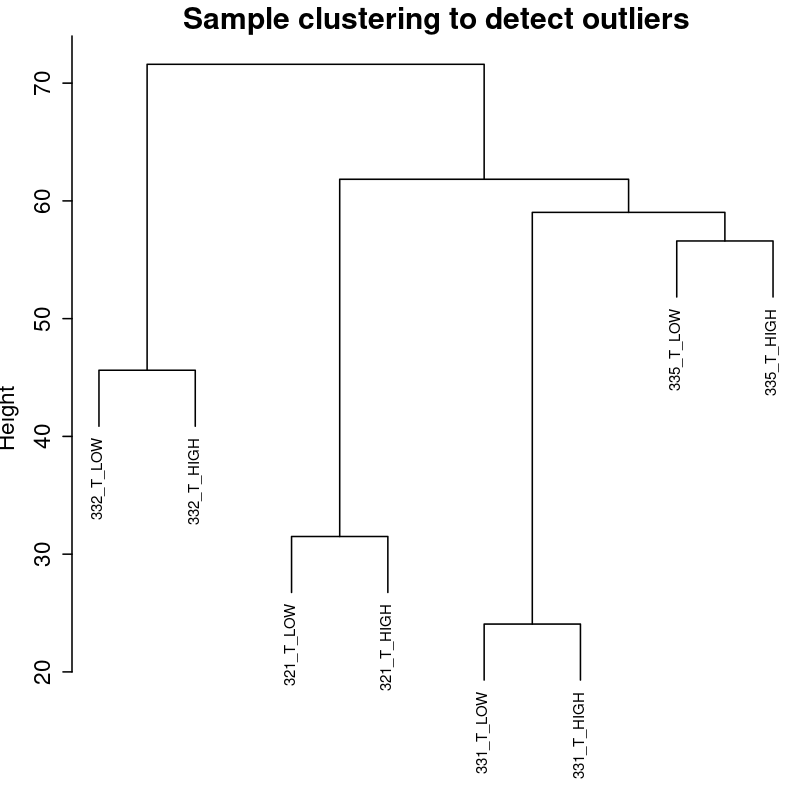
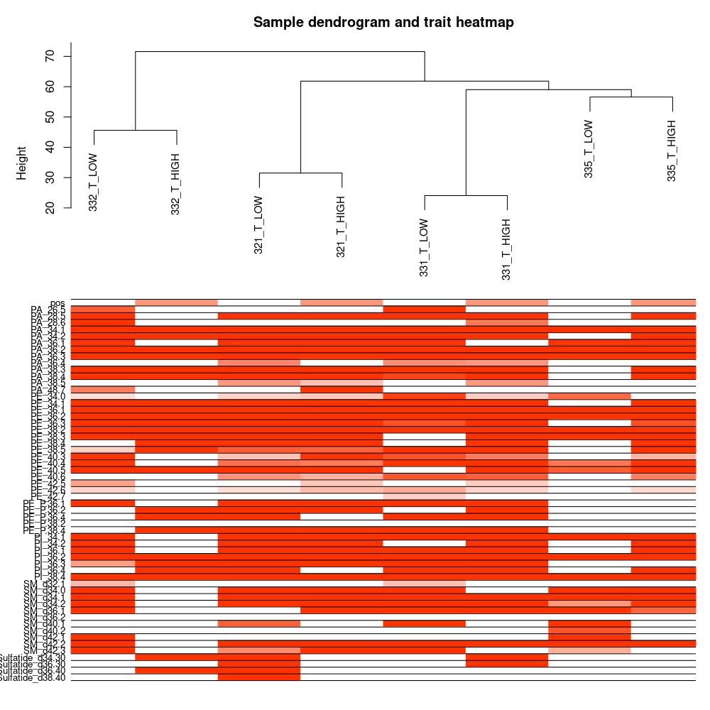
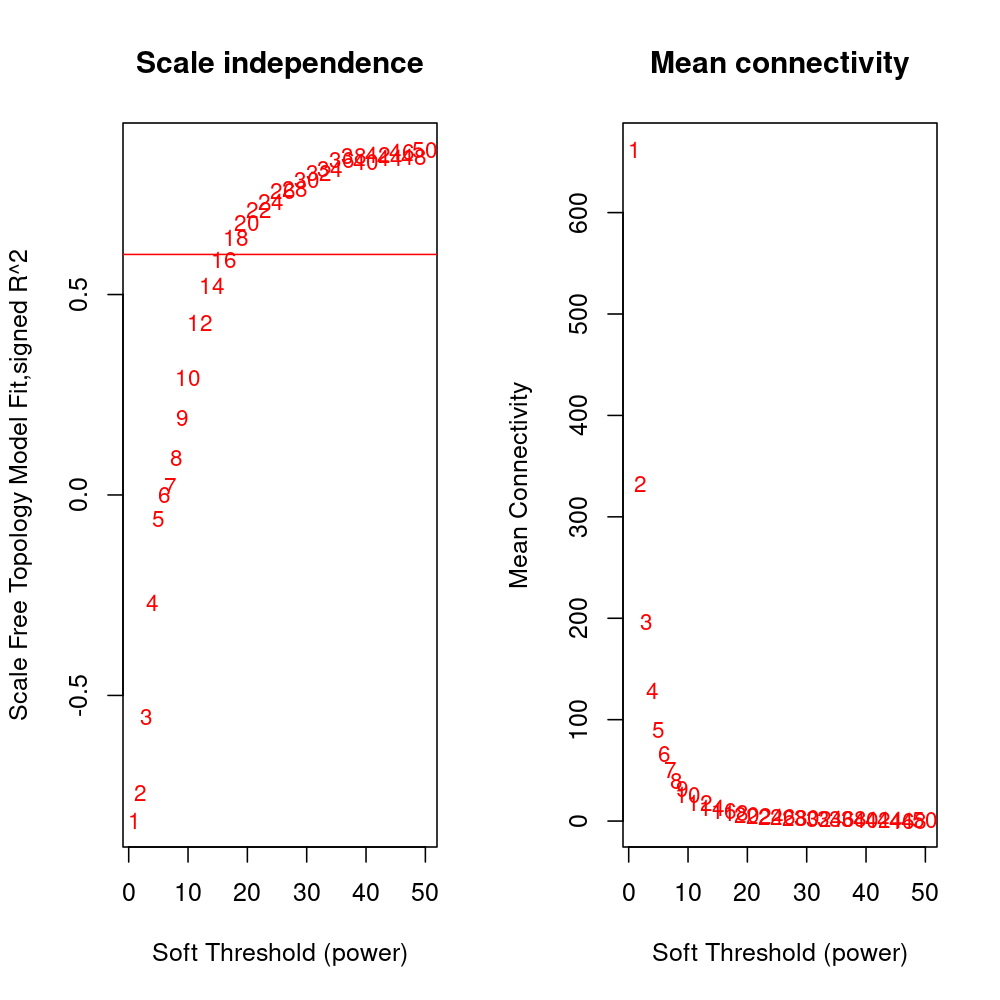
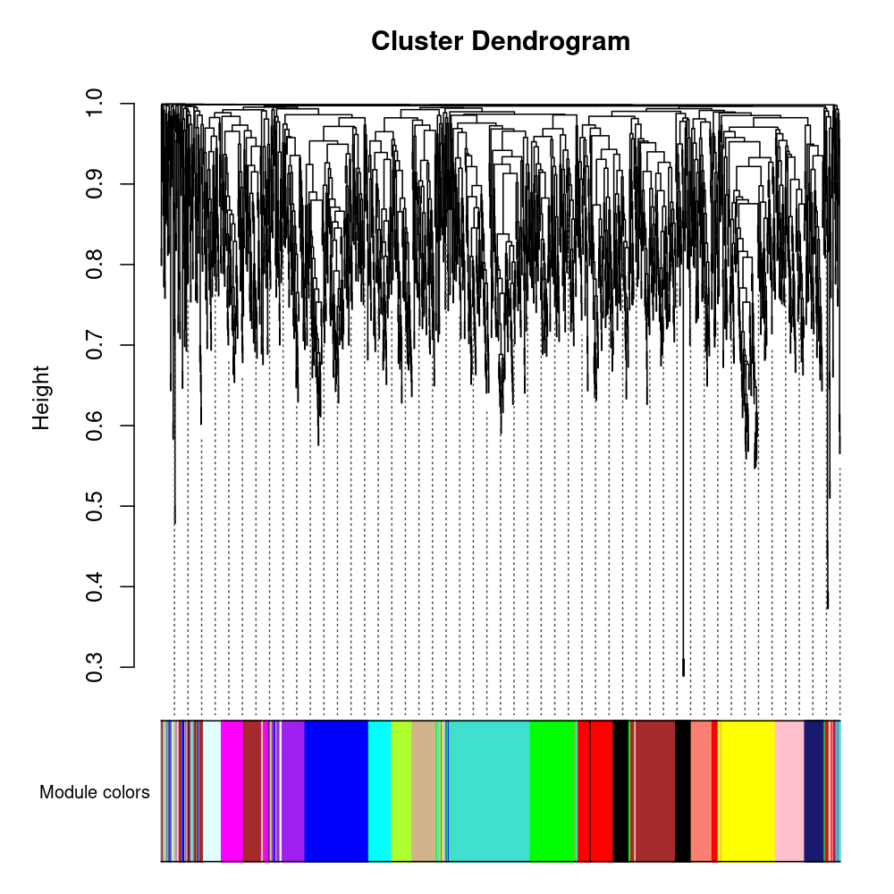
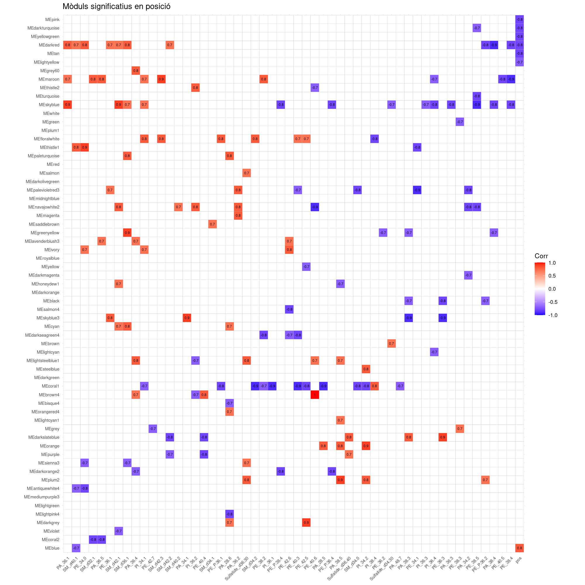

```{r, include=FALSE}
comp<-"INFORMES"
dir.create(comp)
#logos<-paste("{width=20%}\t{width=125%}")
#logos<-  paste("<center><a href = 'http://www.idisba.es/es/' target = #'_blank'>{#id .class width=125%}</a>
#")

version<-paste0("Versió: ",Sys.time())
```

---
date: "`r version`"
---

<div>
<h3>
#
</h3>
</div>

#  Anotació fenotípica

```{r setup, include=FALSE}
## Global options
source("/usr/local/lib/R/site-library/AnalisisArrays2/templates/llibreries_Informes.R")

knitr::opts_chunk$set(cache = F,warning = F,message = F)
dir.create("./RESULTATS")
dir.create("./RESULTATS/PLOTS")
dir.create("./RESULTATS/PLOTS/MODULS")
dir.create("./RESULTATS/TAULES")
dir.create("./RESULTATS/TAULES/MODULS")
dir.create("./RESULTATS/OBJECTES_R")
```

# Llibrerires

```{r}

# source("./DATA_IN/source/llibreries_WGCNA.R")
source("/home/albert/albert/DATA_IN/source/llibreries_WGCNA.R")
```

# Preparació de les dades

```{r}
## GRUP
grup<-"SA"
# Arrays
## 1. Lectura ja normalitzada

load("./DATA_IN/source/expression_set.RData")
dim_inicial<-dim(data_rma)

## 2. definciio fenotip
if(grup=="TUMOR"){
  g<-"T"
} else if(grup!="TUMOR"){
  g<-"S"
} else{g<-NA}
cond1<-data_rma@phenoData@data$tumor==g&data_rma@phenoData@data$position=="HIGH"
cond2<-data_rma@phenoData@data$tumor==g&data_rma@phenoData@data$position=="LOW"
data_rma$condicio<-rep("condicio",length(data_rma$index))
data_rma$condicio[cond1]<-paste0(grup,"_HIGH")
data_rma$condicio[cond2]<-paste0(grup,"_LOW")
data_rma_sa<-
  data_rma[,data_rma$condicio!="condicio"]

# Eliminar pacient 222
data_rma_sa<-data_rma_sa[,data_rma_sa@phenoData@data$sample!="322"]
datatable_mod(data_rma_sa@phenoData@data)

## 3. Filtrar per sd o per coevient de variació

library(genefilter)
dim(data_rma_sa)

ffun <- filterfun(cv(0.05,Inf))
t.fil <- genefilter(data_rma_sa,ffun)
# apply filter, and put expression back on log scale

dim( data_rma_sa[t.fil,])
data_rma_sa <- data_rma_sa[t.fil,]

# vars <- apply(data_rma_sa, 1,sd)
# sd_cut<-0.6
# print(paste0("Filtrat per sd= ",sd_cut))
# data_rma_sa<-(data_rma_sa[vars > quantile(vars, sd_cut), ] )
dim_1<-
dim(data_rma_sa)
print(paste0("Gens descartats= ",(dim_1-dim_inicial)[[1]]))


## Transformar a matriu d'expressió
data_rma_sa<-data_rma_sa[,order(data_rma_sa$position,decreasing = T)]
data_rma_sa_expr<-exprs(data_rma_sa)
datExpr0<-t(data_rma_sa_expr)
dim(datExpr0)
rownames(datExpr0)<-paste0(data_rma_sa@phenoData@data$sample,"_",data_rma_sa@phenoData@data$tumor,"_",data_rma_sa@phenoData@data$position)

# lipids
## Lectura

lipids<-read.csv("/home/albert/albert/APP_SA_srv_albert/WGCNA/DATA_IN/source/allTraits_new_v2_mod.csv")
lipids<-lipids %>% filter(delete!="si",tumor==g)
lipids$arrayID<-paste0(lipids$arrayID,"_",lipids$tumor,"_",lipids$pos)
datatable_mod(lipids)


groups = data_rma_sa@phenoData@data$condicio
groups<-as.factor(groups)
f = factor(groups)
design = model.matrix(~ 0 + f)
data.fit = lmFit(data_rma_sa_expr,design)

contrast.matrix = makeContrasts(paste(colnames(design)[2],"-",colnames(design)[1]),levels=design)
data.fit.con = contrasts.fit(data.fit,contrast.matrix)
data.fit.eb = eBayes(data.fit.con)
tab = topTable(data.fit.eb,coef=1,number=Inf,adjust.method="BH",genelist = data_rma_sa@featureData@data$SYMBOL)

write.csv(tab,"./RESULTATS/TAULES/FC.csv")

```

```{r}
options(stringsAsFactors = FALSE)
```

# Data input

Checking data for excessive missing values and identification of outlier microarray samples
```{r}

gsg = goodSamplesGenes(datExpr0, verbose = 0);
if(gsg$allOK){print("Totes les mostres i gens passen el control de qualitat de WGCNA")}

```

If the last statement returns TRUE, all genes have passed the cuts. If not, we remove the offending genes and samples
from the data:

```{r}
if (!gsg$allOK){
# Optionally, print the gene and sample names that were removed:
if (sum(!gsg$goodGenes)>0)
printFlush(paste("Removing genes:", paste(names(datExpr0)[!gsg$goodGenes], collapse = ", ")));
if (sum(!gsg$goodSamples)>0)
printFlush(paste("Removing samples:", paste(rownames(datExpr0)[!gsg$goodSamples], collapse = ", ")));
# Remove the offending genes and samples from the data:
datExpr0 = datExpr0[gsg$goodSamples, gsg$goodGenes]
}
dim(datExpr0)
# Guardar la matriu d'expressió
save(datExpr0,file = "./RESULTATS/OBJECTES_R/datExpr0")
```

Next we cluster the samples (in contrast to clustering genes that will come later) to see if there are any obvious outliers.

```{r}
sampleTree = hclust(dist(datExpr0), method = "average");
# Plot the sample tree: Open a graphic output window of size 12 by 9 inches
# The user should change the dimensions if the window is too large or too small.
sizeGrWindow(12,9)

png("./RESULTATS/PLOTS/sampleClustering.png",width = 800,height = 800,res = 150)
par(cex = 0.6);par(mar = c(0,4,2,0))
plot(sampleTree, main = "Sample clustering to detect outliers", sub="", xlab="", cex.lab = 1.5,
cex.axis = 1.5, cex.main = 2)
.close<-dev.off()


```


```{r}
arraySamples = rownames(datExpr0)
arraySamples[!arraySamples%in%
lipids$arrayID]
traitRows = match(arraySamples, lipids$arrayID)

datTraits = lipids[traitRows, c(-3,-4,-5,-6,-7)]
rownames(datTraits)<-datTraits$arrayCel
datTraits$tumor<-gsub("S",0,datTraits$tumor)
datTraits$tumor<-gsub("T",1,datTraits$tumor)
datTraits$tumor<-as.numeric(datTraits$tumor)
datTraits$pos<-gsub("HIGH",1,datTraits$pos)
datTraits$pos<-gsub("LOW",0,datTraits$pos)
datTraits$pos<-as.numeric(datTraits$pos)


# Re-cluster samples
sampleTree2 = hclust(dist(datExpr0), method = "average")

# Convert traits to a color representation: white means low, red means high, grey means missing entry
traitColors = numbers2colors(datTraits, signed = F,lim = c(0,2));
# Plot the sample dendrogram and the colors underneath.
png("./RESULTATS/PLOTS/sampleClustering_2.png",width = 1000,height = 1000,res = 100)
plotDendroAndColors(sampleTree2, traitColors,
groupLabels = names(datTraits),
main = "Sample dendrogram and trait heatmap")
.close<-dev.off()
save(datExpr0, datTraits, file = paste0(grup,"_lipids-01-dataInput.RData"))

```

In the plot,  white means a low value, red a high value, and grey a missing entry.


# Network

```{r,message=F}
# Choose a set of soft-thresholding powers
powers = c(c(1:10), seq(from = 12, to=50, by=2))
# Call the network topology analysis function


if(!file.exists("./RESULTATS/OBJECTES_R/pickSoftThreshold")){
sft = pickSoftThreshold(datExpr0,
                        powerVector = powers,
                        corFnc = "bicor",
                        networkType = "unsigned",
                        verbose = 0)
save(sft,file = "./RESULTATS/OBJECTES_R/pickSoftThreshold")
}else{load("./RESULTATS/OBJECTES_R/pickSoftThreshold")}

# Plot the results:

# Scale-free topology fit index as a function of the soft-thresholding power

png("./RESULTATS/PLOTS/beta.png",width = 1000,height = 1000,res = 150)
par(mfrow = c(1,2));
cex1 = 0.9;

plot(sft$fitIndices[,1], -sign(sft$fitIndices[,3])*sft$fitIndices[,2],
xlab="Soft Threshold (power)",ylab="Scale Free Topology Model Fit,signed R^2",type="n",
main = paste("Scale independence"));
text(sft$fitIndices[,1], -sign(sft$fitIndices[,3])*sft$fitIndices[,2],
labels=powers,cex=cex1,col="red");
  # this line corresponds to using an R^2 cut-off of h
abline(h=0.9,col="red")
# # Mean connectivity as a function of the soft-thresholding power
plot(sft$fitIndices[,1], sft$fitIndices[,5],
xlab="Soft Threshold (power)",ylab="Mean Connectivity", type="n",
main = paste("Mean connectivity"))
text(sft$fitIndices[,1], sft$fitIndices[,5], labels=powers, cex=cex1,col="red")

.close<-dev.off()

beta<-12

```


We choose the power `r beta`, which is the lowest power for which the scale-free topology fit index curve flattens out upon reaching a high value (in this case, roughly 0.60).


# One-step network construction and module detection

```{r}

if(file.exists("./RESULTATS/OBJECTES_R/net")){
load("./RESULTATS/OBJECTES_R/net")  
}else{

net = blockwiseModules(datExpr0, power = beta, maxBlockSize = 20000,
                       TOMType = "unsigned",
                       corType = "bicor",
                       minModuleSize = 30,
                       reassignThreshold = 0, mergeCutHeight = 0.25,
                       numericLabels = TRUE, pamRespectsDendro = FALSE,
                       saveTOMs = TRUE,
                       saveTOMFileBase = "./RESULTATS/OBJECTES_R/net", 
                       verbose = 3)

}

save(net,file="./RESULTATS/OBJECTES_R/net")

# open a graphics window
sizeGrWindow(12, 9)
# Convert labels to colors for plotting
mergedColors = labels2colors(net$colors)
# Plot the dendrogram and the module colors underneath
png("./RESULTATS/PLOTS/module_colors.png",height = 1000,width = 1000,res=150)
plotDendroAndColors(net$dendrograms[[1]], mergedColors[net$blockGenes[[1]]],
"Module colors",
dendroLabels = FALSE, hang = 0.03,
addGuide = TRUE, guideHang = 0.05)
.close<-dev.off()
moduleLabels = net$colors
moduleColors = labels2colors(net$colors)
MEs = net$MEs;
geneTree = net$dendrograms[[1]]
save(MEs,net, moduleLabels, moduleColors, geneTree,file = "./RESULTATS/OBJECTES_R/net_auto")


```


# Relating modules to external clinical traits

Obtenir la correlació de cada mòdul amb els diferents lipids i posició

```{r}
# Define numbers of genes and samples
nGenes = ncol(datExpr0);
nSamples = nrow(datExpr0);
# Recalculate MEs with color labels
MEs0 = moduleEigengenes(datExpr0, moduleColors)$eigengenes
MEs = orderMEs(MEs0)

moduleTraitCor = cor(MEs, datTraits, use = "p");
moduleTraitPvalue = corPvalueStudent(moduleTraitCor, nSamples);


moduleTraitCor<-
moduleTraitCor[order(moduleTraitCor[,"pos"],decreasing = T),]

sizeGrWindow(10,6)
# Will display correlations and their p-values
textMatrix = paste(signif(moduleTraitCor, 2), "\n(",
signif(moduleTraitPvalue, 1), ")", sep = "");
dim(textMatrix) = dim(moduleTraitCor)
par(mar = c(6, 8.5, 3, 3));
# Display the correlation values within a heatmap plot
labeledHeatmap(Matrix = moduleTraitCor,
xLabels = names(datTraits),
yLabels = names(MEs),
ySymbols = names(MEs),
colorLabels = FALSE,
colors = greenWhiteRed(50),
textMatrix = textMatrix,
setStdMargins = FALSE,
cex.text = 0.5,
zlim = c(-1,1),
main = paste("Module-trait relationships"))


cor_value<-c()
p<-c()

for (i in 1:dim(moduleTraitCor)[2]){
  cor_value[i]<-stats::cor(moduleTraitCor[,"pos"],moduleTraitCor[,i])
}
# Ordenar el lipid segons la correalció amb la posició
moduleTraitCor_ord<-(moduleTraitCor[,order(cor_value)])


moduleTraitPvalue = corPvalueStudent(moduleTraitCor_ord, nSamples);


# sizeGrWindow(10,6)
# Will display correlations and their p-values
textMatrix = paste(signif(moduleTraitCor_ord, 2), "\n(",
signif(moduleTraitPvalue, 1), ")", sep = "");
dim(textMatrix) = dim(moduleTraitCor_ord)


# sizeGrWindow(10,6)
# Will display correlations and their p-values

# par(mar = c(6, 8.5, 3, 3));
# Display the correlation values within a heatmap plot
labeledHeatmap(Matrix = moduleTraitCor_ord,
xLabels = colnames(moduleTraitCor_ord),
yLabels = rownames(moduleTraitCor_ord),
ySymbols = rownames(moduleTraitCor_ord),
colorLabels = FALSE,
colors = greenWhiteRed(50),
textMatrix = textMatrix,
setStdMargins = FALSE,
cex.text = 0.5,
zlim = c(-1,1),
main = paste("Module-trait relationships"))


```

Els lipids en gris es perque no tenen variabilitat entre els pacients: 
```{r}

```

## Permutacions

```{r,results='asis'}
library(ggplot2)
# Define numbers of genes and samples
nGenes = ncol(datExpr0);
nSamples = nrow(datExpr0 );
# Recalculate MEs with color labels
MEs0 = moduleEigengenes(datExpr0, moduleColors)$eigengenes
MEs = orderMEs(MEs0)
df_test_0<-read.csv("./DATA_IN/taula_0.csv",row.names = 1)
df_test_1<-matrix(,length(rownames(df_test_0)),length(colnames(MEs0)))
colnames(df_test_1)<-colnames(MEs)
rownames(df_test_1)<-rownames(df_test_0)
df_test_1<-(apply(df_test_1, 2, function(x) !is.na(x)))*1
df_test_0<-df_test_1
df_test_cor_0_pos<-df_test_0
df_test_cor_0_neg<-df_test_0
# Permutacions en funció de les mostres disponibles. Tumor->4, Sa -> 5
# num_perm<-1:(factorial(5)*factorial(5))
num_perm<-1:(factorial(4)*factorial(4))

# unlink("./RESULTATS//OBJECTES_R/df_test_0")
if(!file.exists("./RESULTATS//OBJECTES_R/df_test_0")){
 for(p in num_perm){
  # for(p in 1:100){
  as<-p
  set.seed(p)

  datTraits_perm<-datTraits %>% 
  # group_by(pos) %>%      
  
  group_by(pos) %>%                   # group by "grp" column 
  sample_frac(1)

moduleTraitCor = cor(MEs, datTraits_perm, use = "p");

#ordenar els mòduls per segons la correlació amb la posició
moduleTraitCor<-
moduleTraitCor[order(moduleTraitCor[,"pos"],decreasing = T),]
cor_value<-c()

for (i in 1:dim(moduleTraitCor)[2]){
  cor_value[i]<-stats::cor(moduleTraitCor[,1],moduleTraitCor[,i])
}
# Ordenar el lipid segons la correalció amb la posició
moduleTraitCor_ord<-(moduleTraitCor[,order(cor_value)])
moduleTraitPvalue = corPvalueStudent(moduleTraitCor_ord, nSamples);

# sizeGrWindow(10,6)
# Will display correlations and their p-values
textMatrix = paste(signif(moduleTraitCor_ord, 2), "\n(",
signif(moduleTraitPvalue, 1), ")", sep = "");
dim(textMatrix) = dim(moduleTraitCor_ord)
# Display the correlation values within a heatmap plot

# png("./RESULTATS/PLOTS/Module-trait_original.png",width = 2000,height = 2000,res=200)
# labeledHeatmap(Matrix = moduleTraitCor_ord,
# xLabels = colnames(moduleTraitCor_ord),
# yLabels = rownames(moduleTraitCor_ord),
# ySymbols = rownames(moduleTraitCor_ord),
# colorLabels = FALSE,
# colors = greenWhiteRed(50),
# textMatrix = textMatrix,
# setStdMargins = FALSE,
# cex.text = 0.5,
# zlim = c(-1,1),
# main = paste("Module-trait relationships"))
# .close<-dev.off()

library(ggcorrplot)
p.mat =signif(moduleTraitPvalue, 1)
ggcorrplot(t(moduleTraitCor_ord),
  # p.mat = t(p.mat),
  #   insig = "blank"
)
moduleTraitCor_ord_df<-(moduleTraitCor_ord)
moduleTraitCor_ord_df<-data.frame(moduleTraitCor_ord_df)
p.mat_df<-data.frame(p.mat)

moduleTraitCor_ord_df_filt<-moduleTraitCor_ord_df[p.mat_df$pos<=0.05,]
p.mat_df_filt<-p.mat_df[p.mat_df$pos<=0.05,]

moduleTraitCor_ord_df_filt<-moduleTraitCor_ord_df
p.mat_df_filt<-p.mat_df

moduleTraitCor_ord_df_filt_sign<-
moduleTraitCor_ord_df_filt*(p.mat_df_filt<=0.05)*1
moduleTraitCor_ord_df_filt_sign_pos<-
(apply(moduleTraitCor_ord_df_filt_sign, 1,function(x) x>0))*1
sum(moduleTraitCor_ord_df_filt_sign_pos)

moduleTraitCor_ord_df_filt_sign_neg<-
(apply(moduleTraitCor_ord_df_filt_sign, 1,function(x) x<0))*1
sum(moduleTraitCor_ord_df_filt_sign_neg)

sum(p.mat_df_filt<=0.05)
plot_1<-
ggcorrplot(t(moduleTraitCor_ord_df_filt),
   p.mat = t(p.mat_df_filt),
   insig = "blank",
   lab_size = 2,
   lab = T,
   digits = 1,
  pch.cex = 5,
  tl.cex = 7
)

 png("./RESULTATS/PLOTS/Module-trait.png",width = 2000,height = 2000,res = 150)
 plot_1+ggtitle("Mòduls significatius en posició")
 .close<-dev.off()

# knitr::include_graphics("./RESULTATS/PLOTS/Module-trait_original.png")
# 
# print(plot_1+ggtitle(paste("Mòduls significatius en posició\n Permutació: ",p)))
# print(p)


df_test<-
apply(p.mat_df_filt, 1, function(x) x<=0.05)

df_test<-data.frame(df_test)
dim(df_test_0)
dim(df_test)
df_test_0<-df_test_0+df_test
# write.csv(df_test*0,"./RESULTATS/TAULES/taula_0.csv")
df_test_cor_pos<-data.frame(moduleTraitCor_ord_df_filt_sign_pos)
df_test_cor_0_pos<-df_test_cor_0_pos+df_test_cor_pos
df_test_cor_neg<-data.frame(moduleTraitCor_ord_df_filt_sign_neg)
df_test_cor_0_neg<-df_test_cor_0_neg+df_test_cor_neg

 }

save(df_test_0,file="./RESULTATS/OBJECTES_R/df_test_0")
}
 

load(file="./RESULTATS/OBJECTES_R/df_test_0") 
datatable_mod(df_test_0)

df_test_correlation<-df_test_cor_0_pos*0
for(c in 1:length(colnames(df_test_correlation))){
df_test_correlation[,colnames(df_test_correlation)[c]]<-
paste0(df_test_cor_0_pos[,colnames(df_test_correlation)[c]],"/",df_test_cor_0_neg[,colnames(df_test_correlation)[c]])
}


datatable_mod(df_test_correlation)

library(tidyr)

df_test_0$lipid<-rownames(df_test_0)
##

for (i in 1:dim(moduleTraitCor)[2]){
  cor_value[i]<-stats::cor(moduleTraitCor[,1],moduleTraitCor[,i])
}
plotDat <- gather(df_test_0, key = "lipid_2", value = "value", -lipid)
plotDat<-plotDat %>% group_by(lipid) %>% mutate(value_1=round(value/max(value),1))
save(plotDat,file = "./RESULTATS/OBJECTES_R/plotDat")

plot_2<-ggplot(plotDat, aes(lipid, lipid_2, col = value_1, fill = value_1, label = value_1)) +
  geom_tile() +
  geom_text(col = "black",size=2) +
  theme_minimal() +
  scale_fill_gradient2(low = "green", mid = "yellow", high = "indianred") +
  scale_color_gradient2(low = "green", mid = "yellow", high = "indianred")+ theme(axis.text.x = element_text(angle = 90, vjust = 0.5, hjust=1))

png("./RESULTATS/PLOTS/correlacio_global.png",height = 1000,width = 1000,res=100)
plot_2
.close<-dev.off()

plot_2

```

# Gene relationship to trait and important modules: Gene Significance and Module Membership

```{r}
# library(WGCNA)
# Define variable weight containing the weight column of datTrait
for(i in 1:length(colnames(datTraits))){
weight = as.data.frame(datTraits[,i]);
if(var(weight)!=0){
names(weight) = colnames(datTraits)[i]
# names (colors) of the modules
modNames = substring(names(MEs), 3)
geneModuleMembership = as.data.frame(cor(datExpr0, MEs, use = "p"));
MMPvalue = as.data.frame(corPvalueStudent(as.matrix(geneModuleMembership), nSamples));
dim(geneModuleMembership)
table(rownames(geneModuleMembership)==
data_rma_sa@featureData@data$PROBEID)

names(geneModuleMembership) = paste("MM", modNames, sep="");
head(geneModuleMembership)
names(MMPvalue) = paste("p.MM", modNames, sep="");
geneModuleMembership$SYMBOL<-
  data_rma_sa@featureData@data$SYMBOL[match(rownames(geneModuleMembership),data_rma_sa@featureData@data$PROBEID)]

geneModuleMembership$PROBEID<-
  data_rma_sa@featureData@data$PROBEID[match(rownames(geneModuleMembership),data_rma_sa@featureData@data$PROBEID)]

geneTraitSignificance = as.data.frame(cor(datExpr0, weight, use = "p"));
GSPvalue = as.data.frame(corPvalueStudent(as.matrix(geneTraitSignificance), nSamples));
names(geneTraitSignificance) = paste("GS.", names(weight), sep="");
names(GSPvalue) = paste("p.GS.", names(weight), sep="")
f<-1
for(f in 1:length(modNames)){
  module<-modNames[f]
column = match(module, modNames);
moduleGenes = moduleColors==module;

par(mfrow = c(1,1));
png(paste0("./RESULTATS/PLOTS/MODULS/",colnames(datTraits)[i],"_",modNames[f],".png"))
verboseScatterplot(abs(geneModuleMembership[moduleGenes, column]),
                   abs(geneTraitSignificance[moduleGenes, 1]),
                   xlab = paste("Module Membership in", module, "module"),
                   ylab = "Gene significance for body weight",
                   main = paste("Module membership vs. gene significance\n"),
                   cex.main = 1.2, cex.lab = 1.2, cex.axis = 1.2, col = "black")
                   
dev.off()                   
simbols<-geneModuleMembership[moduleGenes, "SYMBOL"]
gens_moduls<-                 
cbind(geneModuleMembership=geneModuleMembership[moduleGenes, column],
      geneTraitSignificance=abs(geneTraitSignificance[moduleGenes, 1]),
      SYMBOL=simbols)

write.csv(gens_moduls,paste0("./RESULTATS/TAULES/MODULS/",colnames(datTraits)[i],"_",modNames[f],".csv"))
}
}
}


```

Els mòduls es guarden  RESULTATS/TAULES/MODULS/ i RESULTATS/PLOTS/MODULS/
```{r}
knitr::include_graphics(paste0("./RESULTATS/PLOTS/MODULS/",colnames(datTraits)[i],"_",modNames[f],".png"))
```


# Network visualization using WGCNA functions

```{r}


dissTOM = 1-TOMsimilarityFromExpr(datExpr0, power = 6)
# Transform dissTOM with a power to make moderately strong connections more visible in the heatmap
plotTOM = dissTOM^7;
# Set diagonal to NA for a nicer plot
diag(plotTOM) = NA;
# Call the plot function
sizeGrWindow(9,9)
png("./RESULTATS/PLOTS/heatmap.png",width = 1000,height = 1000)
TOMplot(plotTOM, geneTree, moduleColors, main = "Network heatmap plot, all genes")
.as<-dev.off()
knitr::include_graphics("./RESULTATS/PLOTS/heatmap.png")
```

```{r}
# Recalculate module eigengenes
MEs = moduleEigengenes(datExpr0, moduleColors)$eigengenes
# Isolate weight from the clinical traits
weight = as.data.frame(datTraits$PI_36.4);
names(weight) = "PI_36.4"

MET = orderMEs(cbind(MEs, weight))
# Plot the relationships among the eigengenes and the trait
sizeGrWindow(5,7.5);
par(cex = 0.9)
plotEigengeneNetworks(MET, "", marDendro = c(0,4,1,2), marHeatmap = c(3,4,1,2), cex.lab = 0.8, xLabelsAngle
= 90)
```


```{r}
sizeGrWindow(6,6);
par(cex = 1.0)
plotEigengeneNetworks(MET, "Eigengene dendrogram", marDendro = c(0,4,2,0),
plotHeatmaps = FALSE)
# Plot the heatmap matrix (note: this plot will overwrite the dendrogram plot)
par(cex = 1.0)
plotEigengeneNetworks(MET, "Eigengene adjacency heatmap", marHeatmap = c(3,4,2,2),
plotDendrograms = FALSE, xLabelsAngle = 90)
```

## Network in r


Per fer-ho interactiu es crea la app

```{r}
# Recalculate topological overlap if needed
TOM<- as.matrix(get(load("./RESULTATS/OBJECTES_R/net-block.1.RData")))
class(TOM)
# save(data_rma,file = "./DATA_IN/source/expression_set.RData")
load("./DATA_IN/source/expression_set.RData")
# Read in the annotation file
annot = data_rma@featureData@data
# Select modules
# save(TOM,file="./RESULTATS/OBJECTES_R/TOM")
# load(file="./RESULTATS/OBJECTES_R/TOM")
load("./RESULTATS/OBJECTES_R/net")
moduleColors = labels2colors(net$colors)
modules=moduleColors
dev.off()
# Seleccionar els mòduls
modules = c("blue","green","pink");
# Select module probes
probes = colnames(datExpr0)
inModule = is.finite(match(moduleColors, modules));

modProbes = probes[inModule];
modGenes = annot$SYMBOL[match(modProbes, annot$PROBEID)];
# Select the corresponding Topological Overlap

modTOM = TOM[inModule, inModule]
dimnames(modTOM) = list(modProbes, modProbes)
```


```{r}
library(igraph)


adj <- modTOM
adj[adj > 0.01] = 1
adj[adj != 1] = 0
network <- graph.adjacency(adj)
network <- simplify(network)  # 

network <- graph.adjacency(adj)
network <- simplify(network)  # removes self-loops

V(network)$color <- moduleColors[inModule]
par(mar=c(0,0,0,0))
# remove unconnected nodes

network <- delete.vertices(network, degree(network)==0)
set.seed(123)
labels<-data_rma@featureData@data$SYMBOL[match(names(V(network)),data_rma@featureData@data$PROBEID)]

plot(network,
     layout=layout.fruchterman.reingold(network),
     edge = 0.01,
     edge.arrow.size = 0.1,
      # vertex.label = "",
     vertex.label = labels,
     vertex.label.cex =0.5,
     vertex.size=5)


```

<!-- # Generar Cytoscape -->
<!-- ```{r} -->
<!-- cyt = exportNetworkToCytoscape(modTOM, -->
<!-- edgeFile = paste("CytoscapeInput-edges-", paste("modules", collapse="-"), ".txt", sep=""), -->
<!-- nodeFile = paste("CytoscapeInput-nodes-", paste("modules", collapse="-"), ".txt", sep=""), -->
<!-- weighted = TRUE, -->
<!-- threshold = 0.1, -->
<!-- nodeNames = modProbes, -->
<!-- altNodeNames = modGenes, -->
<!-- nodeAttr = moduleColors[inModule]) -->

<!-- edge<-cyt$edgeData[complete.cases(cyt$edgeData),] -->
<!-- node<-cyt$nodeData[complete.cases(cyt$nodeData),] -->

<!-- ``` -->


<div class = "center">

<a href="informe-copy.html" download="Analisis_Arrays"> <strong> Download Page </strong> </a>

<address>

<strong>Written by:</strong><a href="mailto:josep.muncunill@ssib.es">\
Josep Muncunill Farreny (Bioinformático)</a><br><strong> Designed by:</strong><a href="mailto:ignasi.delsalto@ssib.es">\
Ignasi Del Salto Estrany (Programador y Diseñador)</a><br><strong> Visit us at:</strong><a href="https://bioinfo.conectabalear.net/shiny/"  target = '_blank'>\
https://bioinfo.conectabalear.net/shiny/</a></br>

</address>

&#169; Departamento de Genómica y Bioinformática de <strong> IDISBA </strong>

<div class = "logos">
<center><a href = 'http://www.idisba.es/es/Servicios/Plataformas-Cient%C3%ADfico-T%C3%A9cnicas/Gen%C3%B3mica-y-Bioinform%C3%A1tica' target = '_blank'></a>
<a href = 'http://www.idisba.es/es/' target = '_blank'></a></center>
</div>
</div>
